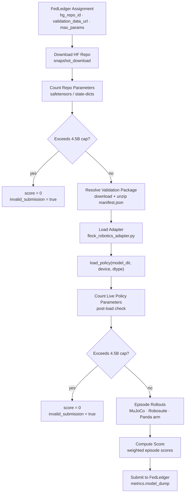

# Robotics VLA Validator

Validates Vision-Language-Action (VLA) policies submitted to [FLock AI Arena](https://flock.io) for the robotics task type. Miners submit a HuggingFace model repository containing a policy and a thin adapter file; the validator downloads it, rolls out the policy in a MuJoCo tabletop simulation, and scores task completion.

---

## Evaluation Pipeline



Each step that touches miner code retries up to 3 times on transient failure before the submission is declared invalid.

---

## Scoring

The primary optimisation target is **`loss`** (lower is better). Score is the complementary metric (higher is better).

### Per-episode score

```
progress_score  = 1.0                          if task succeeded
                  clip(best_shaped_reward, 0, 1) otherwise

episode_score   = 1.0                          if task succeeded
                  0.40 × progress_score         otherwise   ← partial credit, capped at 40%
```

### Difficulty weighting

Each episode in the manifest carries a `difficulty` tag that scales its contribution:

| Difficulty  | Weight |
|-------------|--------|
| `low`       | 0.75   |
| `medium`    | 1.00   |
| `hard`      | 1.25   |
| `very_high` | 1.50   |

### Final metrics

```
weighted_episode_score = weighted_mean(episode_score,  weights=difficulty_weights)
loss                   = weighted_mean(1−episode_score, weights=difficulty_weights)
score                  = weighted_episode_score
```

A fully failing submission (`episode_score = 0` everywhere) scores **loss = 1.0**.  
A perfect submission (`episode_score = 1` everywhere) scores **loss = 0.0**.

---

## Submission Contract

Miners must push a HuggingFace repository containing:

| File | Required | Description |
|------|----------|-------------|
| `flock_robotics_adapter.py` | **Yes** | Defines `load_policy(model_dir, device, dtype) → policy` where `policy.act(obs) → np.ndarray shape (7,)` |
| Model weights | **Yes** | `*.safetensors` or `*.pt` / `*.bin` files. Total parameter count must be ≤ 4.5 B (checked both in the repo and after loading). |

### Observation dict passed to `policy.act`

```python
obs = {
    "image":       np.ndarray,   # uint8 HxWx3, agentview camera (default 224×224)
    "instruction": str,          # natural-language task description
    "proprio":     np.ndarray,   # float32, concatenation of joint pos/vel, eef pos/quat, gripper
    "task":        str,          # e.g. "lift_cube", "pick_place_can"
    "step":        int,          # current timestep within the episode
    "difficulty":  str | None,   # episode difficulty tag
    "horizon":     int,          # total steps in this episode
}
```

### Action format

`policy.act(obs)` must return a `(7,)` float32 array in `[-1, 1]`.  
Values outside `[-1, 1]` are clipped. Actions are mapped to the Panda OSC controller:

| Index | Dimension |
|-------|-----------|
| 0–2   | End-effector Δx, Δy, Δz |
| 3–5   | End-effector Δroll, Δpitch, Δyaw |
| 6     | Gripper open (−1) / close (+1) |

---

## System Requirements

### Hardware

- **GPU**: CUDA-capable GPU strongly recommended (the validator loads full VLM weights).
  The reference model (Qwen2.5-VL-3B + 1.2 B action head ≈ 4.06 B params) fits in ~10 GB VRAM at bfloat16.
  The parameter cap for this task is **4.5 B parameters** (checked both pre-load and post-load).
- **RAM**: ≥ 32 GB system RAM for large model repos.
- **Disk**: ≥ 30 GB free for model cache + robosuite assets.

### OS / system libraries

| Requirement | Notes |
|-------------|-------|
| Linux (x86-64) | Recommended for MuJoCo EGL rendering. macOS works for CPU-only testing. |
| Python 3.10 or 3.11 | **3.12 is not supported** — robosuite depends on packages with C extensions that do not yet publish 3.12 wheels. |
| EGL libraries (headless Linux) | `apt-get install -y libegl1 libopengl0 libglx0` — required for MuJoCo offscreen rendering without a display. |
| NVIDIA driver | 525+ recommended when using a GPU. |

### Python packages

All Python dependencies are declared in [`environment.yml`](environment.yml) and are installed automatically by `run.py`. The key ones:

```
mujoco==3.9.0       robosuite==1.5.2     torch           torchvision
transformers        peft                 safetensors      accelerate
huggingface-hub     numpy                pillow           imageio
```

---

## Running Validation

### Prerequisites

```bash
# 1. Clone the repo and install the outer-layer requirements
pip install -r requirements.txt

# 2. (Linux headless only) install EGL libs if not already present
apt-get install -y libegl1 libopengl0 libglx0

# 3. Export credentials
export FLOCK_API_KEY="your_flock_api_key"
export HF_TOKEN="your_huggingface_token"       # needed for private/gated model repos
```

`run.py` creates (or updates) the `flock-validation-robotics_vla` conda environment — or a local venv if conda is absent — and installs all dependencies from `environment.yml` on first run. No manual `pip install` of robotics dependencies is needed.

### One-command production run (FedLedger loop)

```bash
python run.py robotics_vla \
  --task_ids "$ROBOTICS_TASK_ID" \
  --flock-api-key "$FLOCK_API_KEY" \
  --hf-token "$HF_TOKEN"
```

This starts a polling daemon that fetches assignments from FedLedger, validates each submission, and submits results. It keeps running until interrupted.

### Local validation (no FedLedger)

Validate a specific HuggingFace model repo or local directory without a live assignment:

```bash
python run.py robotics_vla \
  --local-validation \
  --hf-model-repo "org/model-repo" \
  --validation-data-url "/path/to/validation_package.zip" \
  --hf-token "$HF_TOKEN"
```

Optionally limit the number of episodes for a faster smoke-test:

```bash
python run.py robotics_vla \
  --local-validation \
  --hf-model-repo "org/model-repo" \
  --validation-data-url "/path/to/validation_package.zip" \
  --max-episodes 3 \
  --hf-token "$HF_TOKEN"
```

A successful run prints metrics including `invalid_submission: false` and the final `loss` / `score`.

---

## FAQ

### EGL / rendering errors on headless servers

**Symptom:**
```
AttributeError: 'NoneType' object has no attribute 'eglQueryString'
mujoco.FatalError: gladLoadGL error
```

**Fix:** Install the GLVND EGL dispatch library — the NVIDIA vendor driver alone is not enough:
```bash
apt-get install -y libegl1 libopengl0 libglx0
```

Then ensure the environment variables are set before launching:
```bash
export MUJOCO_GL=egl
export PYOPENGL_PLATFORM=egl
```

`run.py` sets these automatically inside the validation environment, but they are needed if you run the inner script directly.

---

### Python 3.12 not supported

**Symptom:**
```
ERROR: Could not find a version that satisfies the requirement robosuite==1.5.2
```
or a C-extension build failure during `pip install`.

**Fix:** Use Python 3.10 or 3.11. If using conda:
```bash
conda create -n robotics_vla python=3.11
```

---

### `torchvision` missing

**Symptom:**
```
ImportError: Qwen2VLVideoProcessor requires the Torchvision library. ...
```

**Fix:** `torchvision` is listed in `environment.yml` and installed automatically by `run.py`. If running the inner entrypoint directly in a bare environment:
```bash
pip install torchvision
```

---

### `ModuleNotFoundError: No module named 'validator'`

**Symptom:** Occurs when running training scripts or inner modules directly from the shell.

**Fix:** Run from the repo root with the `PYTHONPATH` set:
```bash
PYTHONPATH=/path/to/flock-validator python validator/modules/robotics_vla/...
```

---

### `adapter_contract: adapter_filename must resolve inside the model directory`

**Symptom:** Validation fails with `failure_mode: adapter_contract` even though the adapter file is present.

**Cause (for adapter authors):** The adapter filename passed in `RoboticsVLAInputData.adapter_filename` contains `..` components or is an absolute path. The contract requires the adapter to be at the top level of the model repo.

**Note:** HuggingFace `snapshot_download` stores repo files as symlinks into a sibling `blobs/` directory. The validator handles this correctly using a lexical path check — it does not follow symlinks, so a legitimate HF download will never trigger this error.

---

### CUDA out of memory

**Symptom:**
```
torch.OutOfMemoryError: CUDA out of memory.
```

**Options:**
- Use `torch_dtype: bfloat16` in `configs/robotics_vla.json` (default).
- Set `device: cpu` in the config for CPU-only testing (much slower).
- Reduce `max_episodes` to shorten the run without loading a second model.

The validator loads the full policy once and rolls out all episodes sequentially; OOM during loading means the GPU does not have enough VRAM for the model.

---

### Validation never picks up an assignment

**Symptom:** The daemon polls indefinitely with `No assignment found`.

**Check:**
1. Confirm `ROBOTICS_TASK_ID` is correct and the task is active on FedLedger.
2. Confirm `FLOCK_API_KEY` is valid (test with the FedLedger API directly).
3. Check `--assignment-lookup-interval` (default 180 s) — the daemon sleeps between polls.

---

### `invalid_submission: true` in the result

The submission was scored 0. The `diagnostics.failure_mode` field explains why:

| `failure_mode` | Meaning |
|----------------|---------|
| `adapter_missing` | No `flock_robotics_adapter.py` in the repo |
| `adapter_contract` | Adapter filename escapes the model directory |
| `adapter_import_failed` | The adapter file raised an exception on import |
| `model_load_failed` | `load_policy(...)` raised an exception after retries |
| `invalid_action` | `policy.act(obs)` returned a non-numeric, wrong-shape, or NaN/Inf array |
| `policy_execution_failed` | `policy.act(obs)` raised an exception after retries |
| `parameter_limit_exceeded` | Parameter count exceeds `max_params` (checked pre- and post-load) |
| `parameter_count_unknown` | Could not determine parameter count from repo weights or loaded policy |
