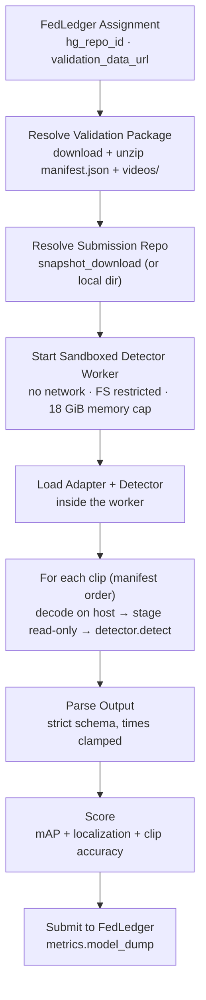

# Video Inconsistency Validator

Validates video-forensics detectors submitted to [FLock AI Arena](https://flock.io) for the `video_inconsistency` task type. Each validation clip is a short, continuous shot into which 0-4 known inconsistencies were injected (0 for clean clips, 1 for `easy`, 1-2 `medium`, 2-3 `hard`, 2-4 `expert`). A trainer submits a Hugging Face repository containing **any** code and model plus a thin adapter file; the validator loads it inside a sandbox, feeds it one video at a time, and scores the list of issues the detector reports against hidden ground-truth labels.

Suite version: **`video_inconsistency_v2`** (v1 packages are not comparable). v2 adds an `expert` difficulty tier, **decoys**, post-edit degradation (per-clip compression quality), and rank-based **mean average precision** scoring.

**Decoys** are hard negatives: legitimate, unlabelled events that look abrupt but are not inconsistencies. They are placed in edited and clean clips alike (about 1.1 per clip) and are never scored; a detector that fires on them pays in precision. There are 14 decoy types, most of them a deliberate look-alike of one issue type:

| Decoy | Looks like |
|-------|------------|
| `scene_cut` (permanent switch to a new shot) | `spliced_footage`, `dropped_frames` |
| `exposure_drift`, `auto_exposure_step`, `illumination_flicker` | `exposure_flicker`, `color_grade_jump` |
| `white_balance_drift`, `auto_white_balance_step` | `color_grade_jump` |
| `smooth_zoom`, `fast_zoom` (continuous, never snaps back) | `zoom_jump` |
| `camera_direction_change`, `camera_speed_change` | `reversed_segment`, `dropped_frames` |
| `camera_stops`, `object_stops` | `frozen_frames` |
| `object_enters`, `object_exits` | `inserted_object` |

Decoys never overlap the transition of the issue type they imitate, so every label stays unambiguous. They are recorded in the package manifest (`ClipSpec.decoys`) for analysis and for training data, and their counts are reported in `diagnostics.decoy_counts`; they never reach the sandbox.

Trainers: start with the sample submission and data generator in [`trainer_sample/README.md`](trainer_sample/README.md).

---

## Evaluation Pipeline



The package is resolved **first**, so infrastructure problems (bad URL, corrupt zip, suite mismatch) surface before the submission is touched and never penalise the trainer.

Per clip, a `detect` call that raises or returns malformed output is retried (`detect_retries`, default 2 extra attempts). If it still fails, the clip is scored as an empty answer and counted as failed. Once more than `max_failed_clip_fraction` (default 25%) of the planned clips have failed the evaluation stops and the submission is invalid, reported with the most common per-clip failure mode. Fatal sandbox errors (timeout, memory breach, worker crash, protocol violation) end the evaluation immediately.

---

## Issue types

Times follow one convention everywhere (labels, detector output, scoring): frame `i` covers `[i / fps, (i + 1) / fps)`. An issue over frames `s..e` inclusive has `start_time = s / fps` and `end_time = (e + 1) / fps`. A point event at the cut before frame `k` has `start_time == end_time == k / fps`. Bounding boxes are normalised `[x0, y0, x1, y1]` in `[0, 1]`.

| Name | What it looks like | Labelled as |
|------|--------------------|-------------|
| `frozen_frames` | Motion stops: the same frame is held for a run of frames, then motion resumes with a jump. | span |
| `dropped_frames` | A run of frames was cut out mid-shot, so objects and camera jump forward instantly. | point (at the cut) |
| `reversed_segment` | A segment plays backwards, then snaps forward again. | span |
| `spliced_footage` | Frames from an unrelated shot are inserted into a continuous shot. | span |
| `color_grade_jump` | The colour grade / white balance changes abruptly for a segment, then changes back. | span |
| `exposure_flicker` | One to three frames are much brighter or darker than their neighbours. | span (very short) |
| `mirrored_segment` | A segment is horizontally flipped, so the scene layout swaps sides. | span |
| `zoom_jump` | A segment is abruptly punched in (cropped and scaled up), then snaps back. | span |
| `inserted_object` | A foreign object pops in and out and does not interact with the scene. | span + bbox |
| `blurred_region` | A rectangular region is blurred or pixelated for a segment. | span + bbox |

Notes:

- Every issue is genuinely visible to a careful human looking at the frames, but v2 clips are compressed at a per-clip quality and contain decoys, so a bare frame-difference spike is no longer evidence of an edit: a `scene_cut`, a smooth zoom or an object entering the frame produces similar signals.
- `frozen_frames`, `reversed_segment`, `dropped_frames` and `spliced_footage` must be told apart from camera stops, objects stopping and legitimate cuts; `color_grade_jump` and `exposure_flicker` from gradual exposure / white-balance drift; `zoom_jump` from smooth zooms; `inserted_object` from objects that enter or leave naturally.
- The two spatial types (`inserted_object`, `blurred_region`) are only credited by mAP when the prediction also carries a bbox that overlaps the labelled box (see [Scoring](#scoring)).

The canonical list lives in [`issue_types.py`](issue_types.py); changing it bumps `SUITE_VERSION`.

---

## Submission Contract

The repository root must contain:

| File | Required | Description |
|------|----------|-------------|
| `flock_video_adapter.py` | **Yes** | Defines `load_detector(model_dir, device, dtype) -> detector`, where `detector.detect(video) -> dict \| list`. |
| Model weights / code | As needed | Everything used at inference time must be inside the repository (there is no network). The detector (weights + working set) must fit the sandbox memory ceiling (default **18 GiB**). |

The adapter filename is configurable per submission (`adapter_filename`); the default is `flock_video_adapter.py` and it must sit at the top level of the repo.

### The `video` dict passed to `detect`

| Key | Type | Meaning |
|-----|------|---------|
| `frames` | `np.ndarray` (T, H, W, 3) uint8 RGB | Decoded frames, a **read-only** memmap |
| `frames_path` | `str` | Path to the same frames as a `.npy` file |
| `video_path` | `str` | Path to the original `.mp4` (decode it yourself if you prefer) |
| `fps` | `float` | Frames per second |
| `num_frames` | `int` | T |
| `width`, `height` | `int` | Frame size |
| `duration` | `float` | `num_frames / fps` |
| `issue_types` | `list[str]` | The canonical issue type names |

### Return value

Either `{"issues": [...]}` or a bare list. Each issue:

```json
{"type": "zoom_jump", "start_time": 2.0, "end_time": 3.4,
 "confidence": 0.87,
 "bbox": [0.1, 0.2, 0.5, 0.6],
 "description": "free text, not scored"}
```

- `type` must be one of the ten names above; `start_time` / `end_time` finite numbers in seconds (booleans are rejected). Both are clamped into `[0, duration]`; `end_time >= start_time` must hold after clamping. Point events may use `start_time == end_time`.
- `confidence` is optional (default `1.0`) and must lie in `[0, 1]`.
- `bbox` is optional (`null` allowed); when present it must be a valid normalised box (`x0 < x1`, `y0 < y1`, all in `[0, 1]`). It is used for the two spatial types.
- `description` is optional, at most 500 characters, and ignored.
- Unknown extra keys are ignored. More than 1000 issues, or any violation above, marks the output `detector_output_invalid` (retried, then the clip counts as failed).

### Minimal adapter

```python
# flock_video_adapter.py
import numpy as np


class Detector:
    def __init__(self, model_dir: str, device: str, dtype: str):
        # Load weights from model_dir here (never from the network).
        self.device = device

    def detect(self, video: dict):
        frames = video["frames"]            # (T, H, W, 3) uint8
        fps = video["fps"]
        # Toy heuristic: flag frames whose change from the previous frame is far
        # below the clip's typical motion. Frames are never bit-identical (sensor
        # noise and compression are applied after editing), so compare to the median.
        diffs = np.abs(frames[1:].astype(np.int16) - frames[:-1].astype(np.int16)).mean(axis=(1, 2, 3))
        still = np.flatnonzero(diffs < 0.35 * np.median(diffs))
        return {"issues": [{"type": "frozen_frames",
                            "start_time": (int(i) + 1) / fps, "end_time": (int(i) + 2) / fps,
                            "confidence": float(1.0 - diffs[i] / max(np.median(diffs), 1e-6))}
                           for i in still[:10]]}


def load_detector(model_dir: str, device: str, dtype: str) -> Detector:
    return Detector(model_dir, device, dtype)
```

---

## Sandbox

Trainer Python never executes in the validator process. A worker process imports the adapter, loads the model and serves `detect` calls over a bounded JSON protocol (pickle is never accepted). Guarantees:

- **No network.** Network syscalls are denied (seccomp on Linux, `sandbox-exec` on macOS); the worker environment is offline (`HF_HUB_OFFLINE`, `TRANSFORMERS_OFFLINE`). Nothing can be downloaded at runtime. On Linux the only socket the worker may create is a local `AF_UNIX` one, because the CUDA driver needs it during initialisation. `connect` always fails with "no such file" (which is what CUDA sees when no MPS daemon runs), and `sendto`, `sendmsg`, `accept`, `listen` and `socketpair` stay blocked, so that socket cannot reach host daemons or anything else.
- **Clean environment.** No `FLOCK_API_KEY`, `HF_TOKEN`, cloud credentials, proxy settings or validator home directory are visible.
- **Filesystem restriction.** On Linux, Landlock confines the worker to read-only access to the model directory and system libraries, plus a private scratch directory; the validator checkout is not readable.
- **Resource limits.** CPU time, open files (1024) and file size (4 GiB per file) are rlimited. Every `load` and `detect` call has a wall-time limit, and the worker is held to the memory ceiling described below. The worker is killed as a process group on timeout, protocol failure or memory breach.
- **Submissions always come from the Hub.** In production `hg_repo_id` is always resolved through Hugging Face, never as a path on the validator host. Only `--local-validation` accepts a local directory.
- **Frames are staged read-only.** The host decodes each clip and hands it over as a `.npy` file and a neutrally named `.mp4` in a host-owned directory the worker can only read.
- **No labels or clip ids reach the sandbox.** The worker sees pixels, fps and the canonical type list, nothing else: no clip id, package filename, difficulty, source tag or label.
- **Memory ceiling, not parameter count.** `detector_memory_limit_gb` (default **18 GiB**) bounds GPU VRAM via the CUDA allocator fraction and host RAM via a runtime RSS monitor. Parameter count is reported as telemetry only.

Residual limitations, for operators:

- On macOS, `sandbox-exec` denies the network and reads of the extracted validation package and the validator's `.env`. Every other file stays readable, and the Landlock and seccomp guarantees are Linux-only. Use Linux for production.
- The VRAM cap covers `torch` allocations; raw non-`torch` CUDA allocations are not covered. For a hard, kernel-enforced ceiling run the validator in a container with a cgroup memory limit.
- If the host can provide no sandbox at all, evaluation raises an infrastructure error (the assignment is retried/re-queued); it never scores the trainer 0 for it.

---

## Scoring

The primary optimisation target is **`loss = 1 - score`** (lower is better).

The headline term is **mean average precision (mAP)**, the standard detection metric (ActivityNet style, difficulty-weighted). Unlike a thresholded F1 it scores the whole ranked list of detections, which rewards three things a trainer can actually improve: **calibrated confidences** (a correct finding ranked above a false alarm), **precise boundaries** (averaging over several tIoU thresholds means an exact localisation scores higher than a loose one), and **suppressing false alarms** (decoys and hallucinations sink the precision of the type). Because the curve is continuous, scores keep separating good submissions from great ones at the top instead of saturating.

### Shared rules

- **Interval padding.** Any interval (ground truth or prediction) shorter than `min_event_seconds` (0.4 s) is widened symmetrically about its centre to that length, then shifted to stay inside `[0, clip duration]`. This gives point events and 1-3 frame flickers a fair tolerance. Temporal IoU (tIoU) is computed on padded intervals.
- **Difficulty weighting.** Every TP / FP / FN (and every AP increment) is weighted by its clip's difficulty weight: easy 1.0, medium 1.5, hard 2.0, expert 2.5.

### Mean average precision (75% of the score)

1. **Per-clip cap.** Per clip, all predictions are ranked by confidence descending (stable) and only the top `max_predictions_per_clip` (25) are kept; the rest are dropped from the AP computation. There is **no confidence threshold** here: low-confidence guesses simply sit at the bottom of the ranking, so emit your calibrated probabilities.
2. **Ranking and matching**, for each issue type and each tIoU threshold `t` in `tiou_thresholds` (0.3, 0.4, 0.5, 0.6, 0.7): pool that type's predictions over all clips and sort by confidence descending (ties: clip order, then the detector's own prediction order). Walk the list; each prediction is matched to the still-unmatched ground truth **of the same type in the same clip** with the highest tIoU. It is a **true positive** iff
   - that tIoU is `>= t`, and
   - for the spatial types (`inserted_object`, `blurred_region`): the prediction has a bbox whose IoU with that ground truth's bbox is `>= bbox_iou_threshold` (0.3). A prediction without a bbox is never a true positive.

   Otherwise it is a false positive and consumes no ground truth (so a duplicate of an already-matched issue is a false positive). Each TP / FP adds its clip's difficulty weight to the running totals.
3. **AP.** After every prediction compute `precision = TP / (TP + FP)` and `recall = TP / G`, where `G` is the type's total weighted ground truth over all clips. AP is the all-point interpolated area under the precision-recall curve (precision is replaced by its monotone non-increasing envelope, as in VOC2010+ / COCO): `AP = sum over recall steps of (r_i - r_(i-1)) * max_(k >= i) precision_k`.
4. **Which types count.** A type with ground truth scores its AP (0 if it has no predictions). A type with no ground truth anywhere is excluded if it has no predictions, and scores AP = 0 if it has any (a hallucination, even at low confidence). If no type is included at all (every clip clean, no predictions) `mean_ap = 1.0`.
5. **Aggregation.** `per_type_ap[type]` is the mean over thresholds; `ap_by_tiou["0.3"]` etc. is the mean over included types at that threshold; `mean_ap` is the mean over included types and thresholds.

Worked examples (one clip, one ground-truth issue): a single exact prediction has AP 1; two predictions where the higher-confidence one is wrong have AP 0.5 (precision 0 then 1/2 at recall 1); a prediction with tIoU 0.55 is a true positive at 0.3 / 0.4 / 0.5 but not at 0.6 / 0.7, so its AP is 0.6.

### F1, localization and clip accuracy

These keep their v1 definitions (they use `tiou_threshold` = 0.3 and `confidence_threshold` = 0.5) and are still reported, but F1 has weight 0 in the default score.

1. **Filtering and cap.** Per clip, keep predictions with `confidence >= confidence_threshold`, sort by confidence descending (stable). Only the top `max_predictions_per_clip` are matched; every prediction beyond the cap counts as a false positive of its type.
2. **Greedy matching per type**, in confidence order: each prediction takes the unmatched ground truth of the same type with the highest tIoU; a true positive when tIoU `>= tiou_threshold`, else a false positive. Unmatched ground truth are false negatives.
3. **F1.** Per-type precision, recall and F1 from the weighted counts (0 when undefined); types with neither ground truth nor predictions are excluded. `macro_f1` is the mean over included types; `micro_f1`, `precision`, `recall` come from pooled counts; all are 1.0 if no type is included.
4. **Localization.** `localization_score = sum(weight * q over true positives) / (sum(weight over all ground truth) + sum(weight over confident false positives))` (1.0 when both sums are 0). Counting confident false positives in the denominator means firing confident junk to fish for matches is never free. Here `q = tIoU` for non-spatial types and `q = 0.5 * tIoU + 0.5 * bbox_IoU` for the spatial types (a missing predicted bbox gives `bbox_IoU = 0`).
5. **Clip accuracy.** Balanced accuracy of "the clip contains an issue", predicting positive iff the clip has at least one prediction passing the confidence threshold: the mean of the true-positive rate over edited clips and the true-negative rate over clean clips (unweighted; the present class alone if the other is absent).

### Final score

```
score = 0.75 * mean_ap + 0.0 * macro_f1 + 0.20 * localization_score + 0.05 * clip_accuracy     (clipped to [0, 1])
loss  = 1 - score
```

The metrics returned to FedLedger include `mean_ap`, `per_type_ap`, `ap_by_tiou` and the F1 fields. An invalid submission is scored `score = 0`, `loss = 1`, `invalid_submission = true` (`mean_ap = 0`, empty breakdowns) with `diagnostics.failure_mode` and `diagnostics.reason`. The per-type TP / FP / FN counts (F1 path) are in `diagnostics.per_type_counts` (JSON) and the number of decoys per type in the evaluated clips is in `diagnostics.decoy_counts` (JSON).

---

## Configuration

Defaults live in [`configs/video_inconsistency.json`](../../../configs/video_inconsistency.json); per-task overrides go in `configs/tasks/<task_id>.json`.

| Field | Default | Meaning |
|-------|---------|---------|
| `suite_version` | `video_inconsistency_v2` | Must match the package manifest, else the assignment is re-queued |
| `device` / `torch_dtype` | `cuda` / `bfloat16` | Passed to `load_detector` |
| `package_cache_dir` | `.cache/video_inconsistency/package_cache` | Extracted package cache |
| `max_clips` | `null` | Evaluate only the first N clips (smoke tests) |
| `detector_load_timeout_seconds` | 600 | Wall-time limit for adapter import + `load_detector` |
| `detect_timeout_seconds` | 60 | Wall-time limit per `detect` call |
| `detector_memory_limit_gb` | 18 | Sandbox memory ceiling (VRAM + RAM) |
| `detector_cpu_time_seconds` | 7200 | Floor for the worker's CPU-time rlimit. The effective limit is scaled to the run's worst-case wall time (load plus every attempt on every clip) times the host's cores, so it is only a backstop and never fires before a wall-time limit. |
| `allow_local_model_dir` | `false` | Accept a local directory as the submission. `--local-validation` turns it on; keep it off in production |
| `detect_retries` | 2 | Extra attempts for a non-fatal per-clip failure |
| `max_failed_clip_fraction` | 0.25 | Invalid once more than this share of clips failed |
| `tiou_thresholds` | 0.3, 0.4, 0.5, 0.6, 0.7 | tIoU thresholds averaged by mAP |
| `tiou_threshold` | 0.3 | Minimum padded tIoU for a true positive in the F1 / localization terms |
| `bbox_iou_threshold` | 0.3 | Minimum bbox IoU for a spatial true positive in mAP |
| `min_event_seconds` | 0.4 | Padding length for short intervals |
| `confidence_threshold` | 0.5 | F1 / clip accuracy only: predictions below this are discarded there (mAP ranks everything) |
| `max_predictions_per_clip` | 25 | Per-clip cap by confidence; overflow is dropped from mAP and counts as false positives in F1 |
| `difficulty_weights` | easy 1.0 / medium 1.5 / hard 2.0 / expert 2.5 | Weight of each clip's counts; every difficulty needs one |
| `weight_map` / `weight_f1` / `weight_localization` / `weight_clip_accuracy` | 0.75 / 0.0 / 0.20 / 0.05 | Score terms (may be 0); must sum to 1 |

---

## Running Validation

### Prerequisites

```bash
pip install -r requirements.txt
export FLOCK_API_KEY="your_flock_api_key"
export HF_TOKEN="your_huggingface_token"       # needed for private/gated model repos
```

`run.py` creates the `flock-validation-video_inconsistency` conda environment from [`environment.yml`](environment.yml) on first run. It needs [miniconda](https://www.anaconda.com/docs/getting-started/miniconda/install). The environment also provides the libraries trainer code may import inside the sandbox: numpy, scipy, scikit-learn, pillow, opencv-python-headless, av, imageio-ffmpeg, torch, torchvision, transformers, timm, einops, safetensors, accelerate, peft, onnxruntime and huggingface-hub.

### Production run (FedLedger loop)

```bash
python run.py video_inconsistency \
  --task_ids "$VIDEO_TASK_ID" \
  --flock-api-key "$FLOCK_API_KEY" \
  --hf-token "$HF_TOKEN"
```

### Local validation (no FedLedger)

```bash
python run.py video_inconsistency \
  --local-validation \
  --hf-model-repo "org/detector-repo" \
  --validation-data-url "/path/to/validation_package.zip" \
  --hf-token "$HF_TOKEN"
```

Add `--max-clips 5` for a quick smoke test, `--adapter-filename other.py` for a non-default adapter, and `--output-json out.json` to save the metrics. `--hf-model-repo` also accepts a local directory. `--device cpu` overrides the config's `cuda` on machines without a GPU.

### Building validation packages

Dev or private packages are produced by `build_validation_package` (deterministic for a given seed):

```python
from validator.modules.video_inconsistency.package import build_validation_package

build_validation_package("dev_package.zip", num_clips=20, seed=1)        # public dev set
build_validation_package("private_package.zip", num_clips=200, seed=987654)  # keep the seed secret
```

The same is available from the command line: `python -m validator.modules.video_inconsistency.build_package --output dev_package.zip --num-clips 60 --seed 1234` (see that module's docstring for real-footage options and the public-dev vs private-eval guidance).

Package layout: `package.json`, `manifest.json` (clip specs and hidden labels) and `videos/<clip_id>.mp4`. Clip ids are hashes that carry no label information. Videos are encoded with a fixed GOP and scene-cut detection disabled, so keyframe placement never leaks where edits are.

---

## Datasets and difficulty

### Datasets

| Dataset | Where | Contents | Who uses it |
|---------|-------|----------|-------------|
| Trainer dataset | Hugging Face dataset repo `random-sequence/flock-video-inconsistency` | 8000 train + 1000 validation clips (HF `videofolder` layout, `metadata.jsonl` per split with issues and decoys), plus the 200-clip dev package | Trainers |
| Dev package | `dev_package/video_inconsistency_dev_package.zip` in the trainer dataset (`build_package --num-clips 200 --seed 7`) | Standard validation package with labels | Trainers, for `--local-validation` |
| Private evaluation package | Kept offline by the task owner; served to validators through `validation_data_url` | Validation package generated from a **secret** seed | Validators only |

Build the trainer dataset with `python -m validator.modules.video_inconsistency.build_hf_dataset --out-dir <dir> --train-clips 8000 --validation-clips 1000 --dev-package-clips 200 --workers 8`. Add `--push-to-hub <repo_id>` to upload it; repos are created private unless `--public` is given, and the token is read only from `HF_TOKEN`. Train, validation and dev clips come from disjoint seed streams.

Build a private evaluation package with `build_package` and a secret seed. Never publish the seed or the package: the generator is public, so anyone holding the seed can reproduce the labels. `misc/` is gitignored and is a convenient place to keep both.

### Difficulty tiers

Every issue has a magnitude range per tier (the defaults draw clips as easy 10% / medium 25% / hard 35% / expert 30%):

| Issue | easy | medium | hard | expert |
|-------|------|--------|------|--------|
| `dropped_frames` | 0.4-0.8 s | 0.2-0.4 s | 1-2 frames | 1 frame |
| `frozen_frames` | 0.6-1.0 s | 0.3-0.6 s | 2-3 frames | 2 frames |
| `reversed_segment` | 0.8-1.2 s | 0.5-0.8 s | 0.3-0.5 s | 0.2-0.35 s |
| `spliced_footage` | 0.5-0.8 s | 0.27-0.5 s | 2-4 frames, similar scene | 2-3 frames, similar scene |
| `color_grade_jump` | gain 0.15-0.30 / hue 20-40 deg | 0.08-0.15 / 10-20 deg | 0.03-0.06 / 4-8 deg | 0.02-0.04 / 3-5 deg |
| `exposure_flicker` | x1.4-1.8 / x0.5-0.7 | x1.2-1.4 / x0.7-0.82 | x1.08-1.12 / x0.88-0.92, 1 frame | x1.04-1.07 / x0.93-0.96, 1 frame |
| `mirrored_segment` | 0.8-1.2 s | 0.4-0.8 s | 0.3-0.6 s | 0.3-0.5 s, mostly near-symmetric scenes |
| `zoom_jump` | x1.2-1.4 | x1.1-1.2 | x1.03-1.08 | x1.02-1.05 |
| `inserted_object` (size) | 10-15% | 6-10% | 4-6%, moves with the scene | 3-5%, moves with the scene |
| `blurred_region` (size) | 15-25% | 10-15% | 6-10% | 5-8% |

After editing, every clip gets sensor noise, optional blur or rescale, and a per-clip compression quality (CRF 18-28). Every labelled edit must pass a detectability check on the degraded frames, so nothing invisible is ever labelled.

### Calibration

Measured on the 200-clip dev package (seed 7), with each detector trained on generator data:

| Detector | score | easy / medium / hard / expert |
|----------|-------|-------------------------------|
| No detections | 0.03 | 0.03 / 0.03 / 0.03 / 0.03 |
| Rule-based heuristic (trainer sample, untrained) | 0.26 | 0.56 / 0.56 / 0.27 / 0.19 |
| Temporal conv net, 2000 clips (trainer sample) | 0.57 | 0.64 / 0.72 / 0.61 / 0.50 |
| Temporal conv net, 10000 clips, 0.9M params | 0.65 | 0.80 / 0.77 / 0.70 / 0.58 |

The last detector gave the same score through the full sandboxed validator on Linux. The room above 0.65 lies in the spatial types (baseline AP 0), 2-frame freezes and short splices, and boundary precision. Re-run this ladder whenever the generator changes.

---

## FAQ

### `invalid_submission: true` in the result

The submission was scored 0. `diagnostics.failure_mode` says why:

| `failure_mode` | Meaning |
|----------------|---------|
| `model_reference_invalid` | The Hugging Face repo/revision is malformed, missing, gated, or returns a deterministic 4xx response |
| `adapter_missing` | No adapter file (default `flock_video_adapter.py`) in the repo |
| `adapter_contract` | The adapter filename escapes the model directory, or the adapter does not define `load_detector` / return an object with `detect` |
| `adapter_symlink_escape` | The adapter is a symlink pointing outside the repo |
| `adapter_import_failed` | The adapter file raised an exception on import |
| `model_load_failed` | `load_detector(...)` raised, or the worker died while loading |
| `model_load_timeout` | Import + `load_detector` exceeded `detector_load_timeout_seconds` |
| `detector_memory_exceeded` | The detector exceeded the sandbox memory ceiling at load or during detection |
| `detector_timeout` | A single `detect` call exceeded `detect_timeout_seconds` |
| `detector_crashed` | The worker process exited unexpectedly while serving |
| `detector_protocol_error` | The worker sent malformed or oversized protocol data |
| `detector_execution_failed` | `detect` raised on too many clips (per-clip failures beyond `max_failed_clip_fraction`) |
| `detector_output_invalid` | `detect` returned output violating the schema on too many clips, or a result that is not JSON-serialisable / too large |

`detector_execution_failed` and `detector_output_invalid` are per-clip: the clip is retried, then scored as an empty answer. They only invalidate the submission when more than `max_failed_clip_fraction` of clips fail; the per-mode tally is in `diagnostics.failure_counts`.

### The validator raises instead of returning metrics

That is an infrastructure problem, deliberately not blamed on the trainer: a broken or unreachable package, a manifest `suite_version` mismatch (`RecoverableException`), a decoded clip that does not match the manifest, or a host with no sandbox support. Fix the operator-side cause and the assignment is retried.

### Does my detector see labels or clip ids?

No. See [Sandbox](#sandbox).

### macOS local runs refuse to start the sandbox

`sandbox-exec` cannot be nested in some environments. For local debugging only you can set `VIDEO_INCONSISTENCY_ALLOW_UNSAFE_LOCAL_ADAPTER=1`; never do this on a production validator.

### Why did a perfect-looking detector score below 1?

Check `per_type_ap` and `ap_by_tiou` first: a high-confidence false alarm ranked above a correct finding lowers that type's AP, duplicate predictions of one issue are false positives, any prediction of a type that has no ground truth anywhere gives that type AP 0, sloppy boundaries only score at the lower tIoU thresholds, and spatial issues need a bbox with IoU >= `bbox_iou_threshold` to count at all. Decoys (see the table at the top of this page) are the usual source of false alarms. `diagnostics.per_type_counts` holds the thresholded TP / FP / FN counts.

### CUDA fails inside the sandbox with error 304

During initialisation the CUDA driver needs four things the sandbox would otherwise deny:
- it reads `/proc/sys/vm/mmap_min_addr`;
- it reads the worker's own `/proc/self/fd`;
- it names its threads through `/proc/self/task/<tid>/comm`;
- it creates a local `AF_UNIX` socket to probe for an MPS daemon, and binds and listens on an
  abstract `cuda-uvmfd-*` socket.

The sandbox allows exactly these. Only the worker's own `/proc/<pid>` entries are granted.
Because procfs recreates pid inodes, those two rules are attached to descriptors held open for the
worker's lifetime. `connect` is forced to fail with ENOENT, and `accept`, `sendto` and `sendmsg`
stay blocked. This was verified on an RTX A6000 (driver 570) and an L40 (driver 580). If you
change `validator/sandbox/hardening.py`, re-run the Linux GPU test
(`test_worker_runs_cuda_inside_the_sandbox_within_the_memory_cap`) on a GPU host. It is skipped
elsewhere.
